# GitHub Actionsを利用してGo-serverをCroudRunへデプロイする

## 前提
- 当リポジトリはMonorepoとなっており、Go-serverモジュールは`./api`に配置してある。
- GCPでプロジェクト作成は済んでいるものとします。
- 開始前の構成
```
.
├── api
│   ├── main.go
│   ....
└── spec
    └── igusaya_blog.yaml

```

## 準備
### GCP
#### 1.CroudRunの有効化
サービスが有効になっていることを確認します。  

#### 2.サービスアカウントを作成する
左メニューから「IAMと管理」>「サービスアカウント」を選択。
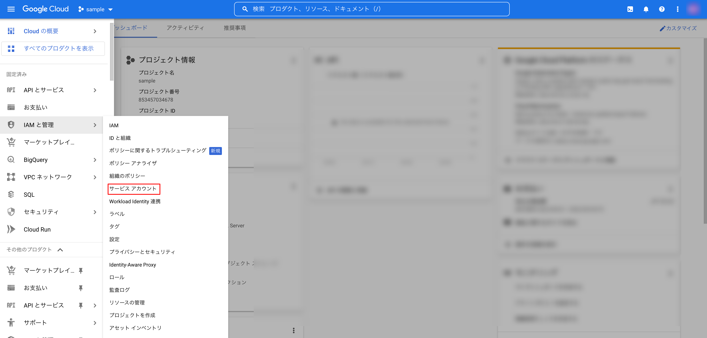

サービスアカウントの画面になったことを確認して、上部の「＋　サービスアカウントを作成」を選択。
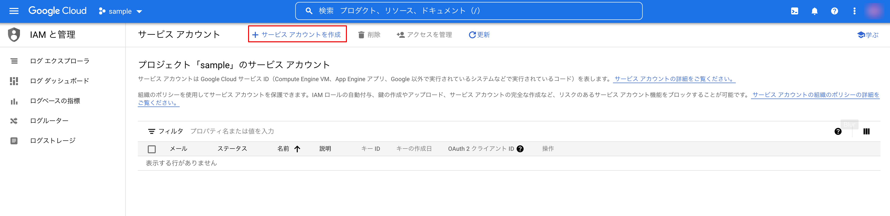

「サービスアカウントの作成」モーダルが開くので適当に記入し「作成して続行」を選択。
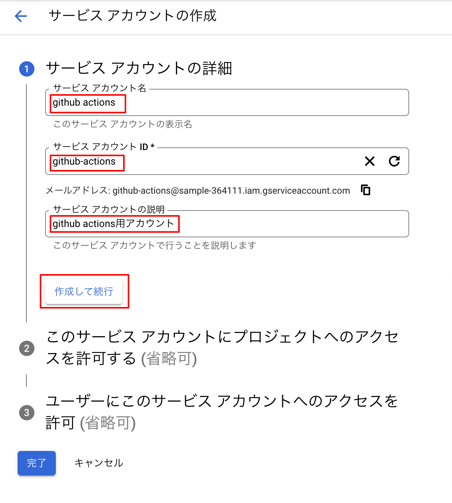

ロールを設定。「Croud Run 管理者」、「Croud Run サービスエージェント」、「ストレージ管理者」を選択。（「＋ 別のロールを追加」選択で入力欄が増えます）  
完了ボタンを押します。
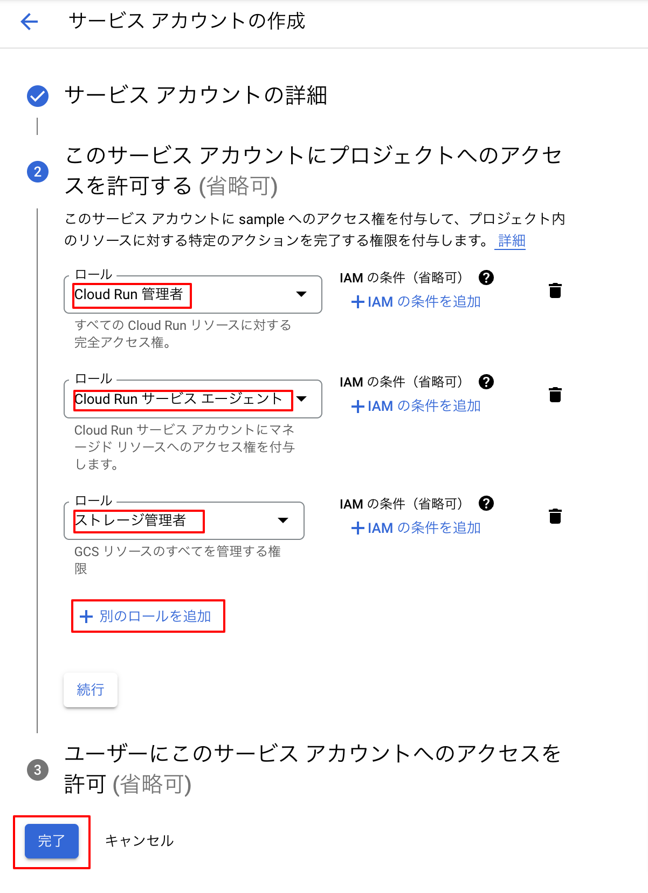

今作成したサービスアカウントが一覧に追加されたことを確認して、メールの部分をクリックします。
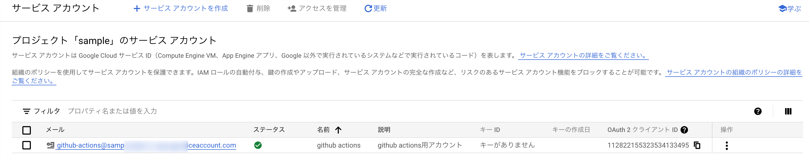

詳細情報のモーダルが開くので上部の「キー」選択し、「鍵を追加」>「新しい鍵を作成」をクリックします。
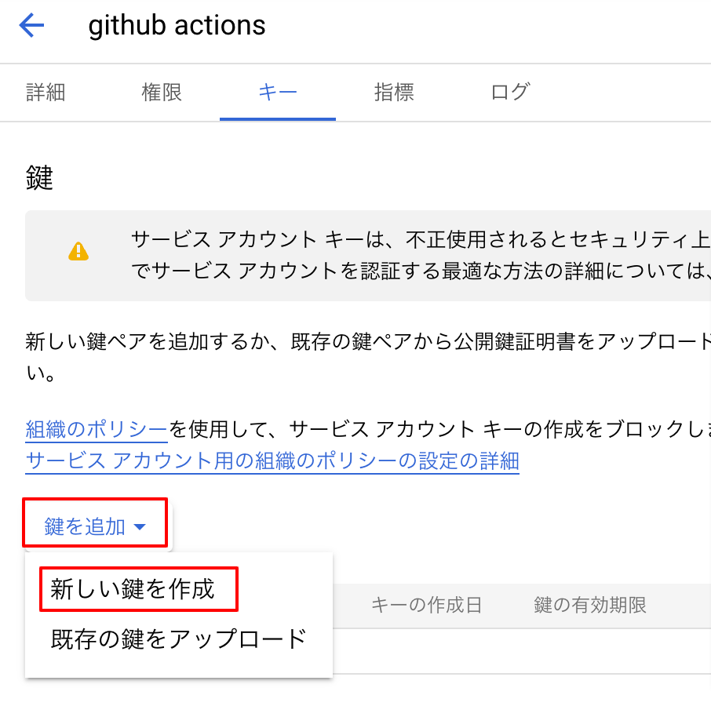

キーのタイプ「JSON」を選択（初期値）し、右下の作成ボタンをクリックします。
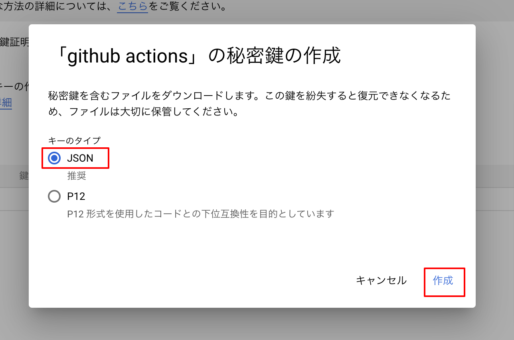

jsonファイルが自動でダウンロードされます。  
これは次項のGitHubの設定で使用するので保存しておいてください。
<p>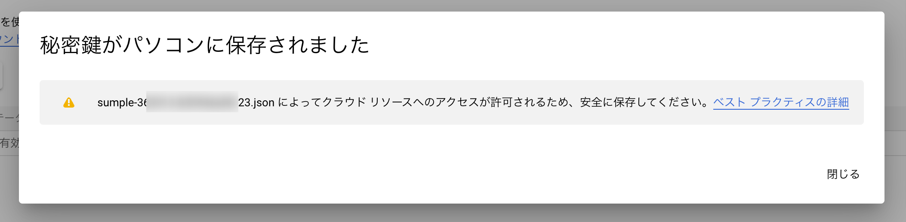</p>

### GitHub
このあと作成する「`.github/workflows/deploy.yml`」が読み込むシークレットを設定します。
#### シークレットの設定
対象リポジトリを開き、「Settings」を選択。
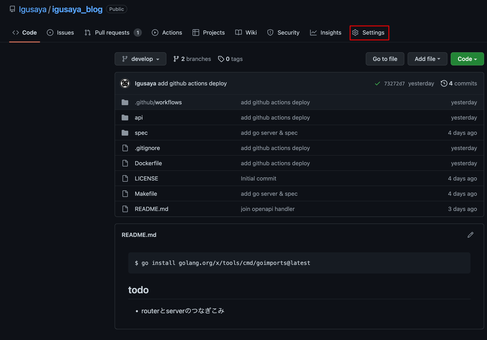

左メニューから「Secrets」>「Action」を選択し、右上の「New repository secret」を選択。
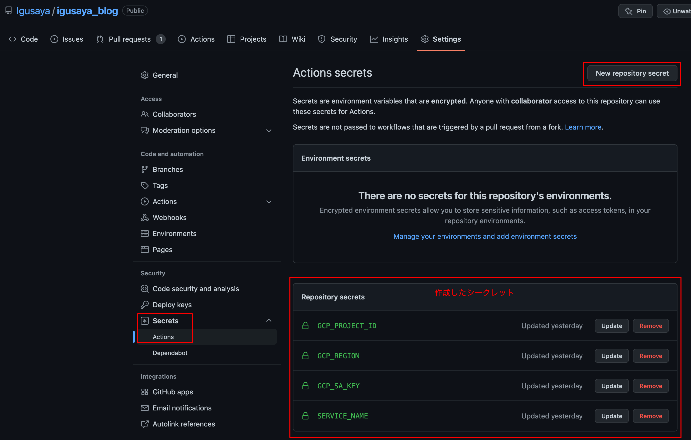

入力画面が表示されるので繰り返しシークレットを入力し「Add secret」ボタンをクリックします。
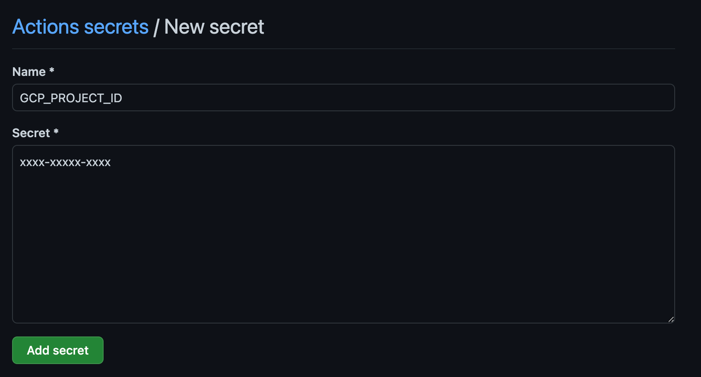
| name* | secret*（例） | 備考|
| ---  | --- | --- |
| GCP_PROJECT_ID | sample | 使用するGCPプロジェクトのID |
| GCP_REGION | asia-northeast1 | [リージョン](https://cloud.google.com/about/locations?hl=ja) |
| GCP_SA_KEY | ※1 | クレデンシャルJSON（設定値の取得方法は以下） |
| SERVICE_NAME | sample | サービス名（Croud Runのサービス名に設定される） |

※１
先程ダウンロードしたjsonファイルをエンコードした値  
```shell
# base64 [保存した場所]/[ダウンロードしたjsonファイル]

$ base64 ./auth/sample-dec695da6e86.json  
ewogICJ0eXBlI......[省略]......0iCn0K
```

出力された「`ewogICJ0eXBlI......[省略]......0iCn0K`」を使用する

### Dockerfile
#### Dockerfileの作成
後に作成するワークフロー定義から読み込むDockerfileを`./api/`配下に作成します。
```shell
$ touch ./api/Dockerfile
```
`./api/Dockerfile`
```docker
# デプロイ用コンテナに含めるバイナリを作成するコンテナ
FROM golang:1.19.1-alpine3.16 as deploy-builder

WORKDIR /app

COPY go.mod go.sum ./
RUN go mod download

COPY . .
RUN go build -o main

# -------------------------------------------

# デプロイ用のコンテナ
FROM alpine:3.15 as deploy

WORKDIR /app
COPY --from=deploy-builder /app/main .

EXPOSE 8080
CMD ["/app/main"]

# -------------------------------------------

```
### workflows
#### ワークフロー定義ファイルを作成
```shell
$ mkdir -p ./.github/workflows 
$ touch ./.github/workflows/deploy.yml
```

`./.github/workflows/deploy.yml`
```yml
name: Deploy
on:
  push:
    branches:
      - develop # developブランチにpushされたらキックされる設定
    paths: # 以下のファイルに変更があった際にキックされる設定   
      - "api/*"
      - ".github/workflows/deploy.yml"
env:
  SERVICE_NAME: ${{ secrets.SERVICE_NAME }} # ${{ secrets.xxxx}}でGitHubに設定したシークレットを読み込む
  GCP_PROJECT_ID: ${{ secrets.GCP_PROJECT_ID }}
  GCP_REGION: ${{ secrets.GCP_REGION }}
  IMAGE: asia.gcr.io/${{ secrets.GCP_PROJECT_ID }}/${{ secrets.SERVICE_NAME }}:${{ github.sha }}
jobs:
  deploy-to-cloud-run:
    runs-on: ubuntu-latest
    steps:
      - name: Checkout the repository
        uses: actions/checkout@v2

      - id: "auth"
        uses: "google-github-actions/auth@v0"
        with:
          credentials_json: "${{ secrets.GCP_SA_KEY }}"

      - name: Configure docker to use the gcloud cli
        run: gcloud auth configure-docker --quiet

      - name: Build a docker image
        run: docker build -t ${{ env.IMAGE }} api/ # Dockerfileが格納されているディレクトリを指定

      - name: Push the docker image
        run: docker push ${{ env.IMAGE }}

      - name: Deploy to Cloud Run
        run: |
            gcloud run deploy ${{ secrets.SERVICE_NAME }} \
              --image $IMAGE \
              --project $GCP_PROJECT_ID \
              --region $GCP_REGION \
              --platform=managed \
              --allow-unauthenticated \
              --quiet \
              --set-env-vars=ENV=PRODUCTION
```

vscode上で上記ymlファイルを作成すると以下のエラー（警告？）が出力される場合があります。
```
Property name is not allowed.yaml-schema: Deployer Recipe
```
対処方法としてvscodeのsettings.jsonに以下を追加すると解決します 。
```json
{
    // ↓追加
    "yaml.schemas": {
        "https://json.schemastore.org/github-workflow.json": [".github/workflows/*.{yml,yaml}"]
    },
}
```

## 確認
お疲れさまでした。  
それではdevelopブランチにpushして動作確認を行います。

### デプロイ状況の確認
Githubの該当リポジトリを開き、上部メニューの「Actions」を選択します。
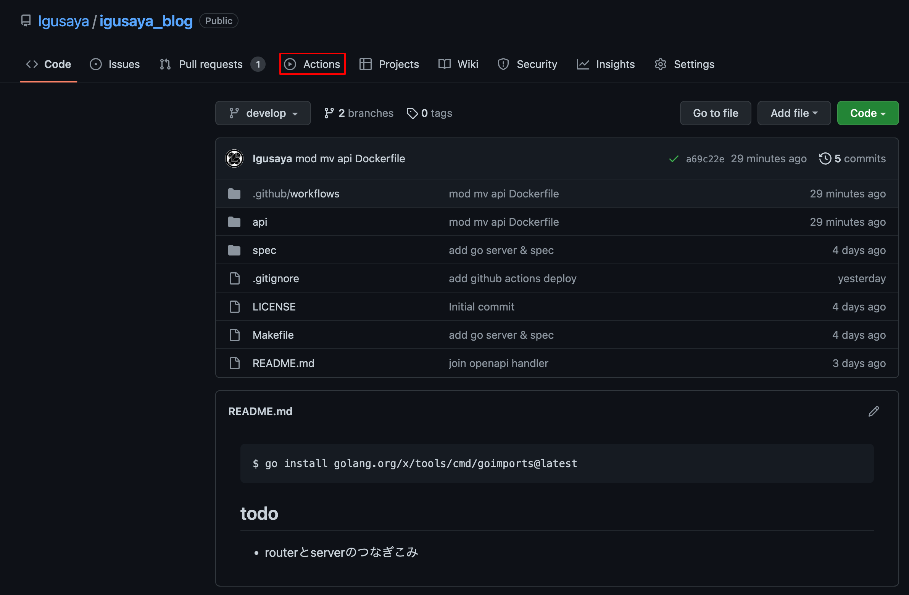

ワークフロー一覧が表示されます。  
詳細が知りたい場合は各ワークフローを選択するとログが見れます。
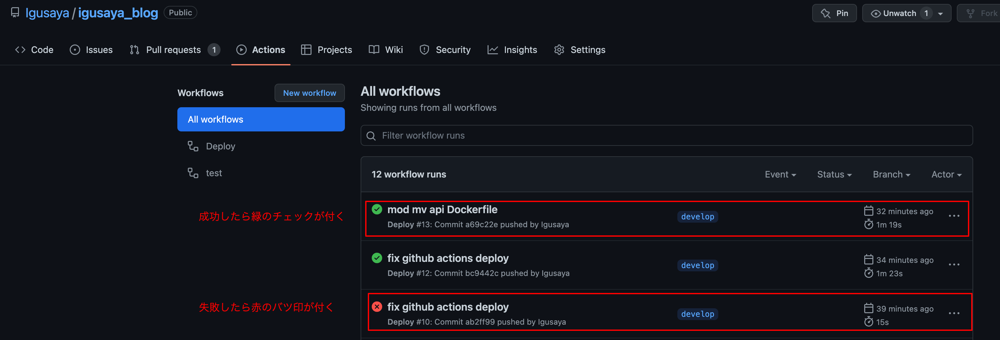

### デプロイ結果の確認
GCPのコンソールを開き、左メニューから「Cloud Run」を選択してください。
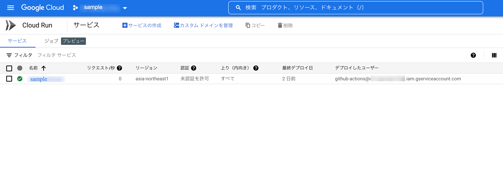

名前のリンクをクリックして詳細画面に移動してください。  
URLがあるので`curl`コマンドで動作確認をしてみましょう。
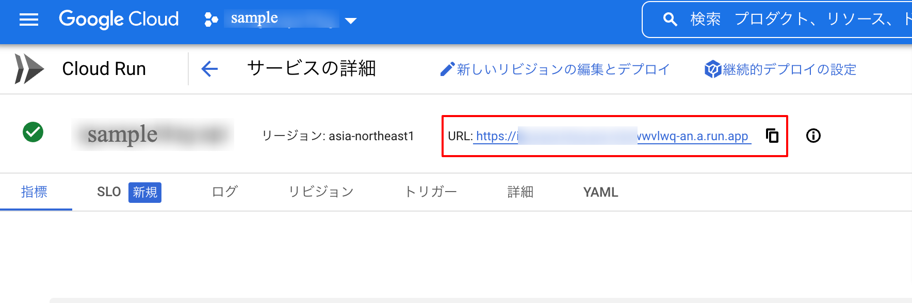

元々`/healt`にGETリクエスト送信すると`{"status":"ok"}`が返却されるように作成してあります。
```shell
$ curl https://xxxxxxxxxxxxxxxxxwwvlwq-an.a.run.app/health
{"status":"ok"} 
```
無事に動作確認も完了しました。  
色々事前準備等があり、手間ではありますが後の開発体験の向上には必須の設定だと思います。  
最後までご覧いただきありがとうございました。